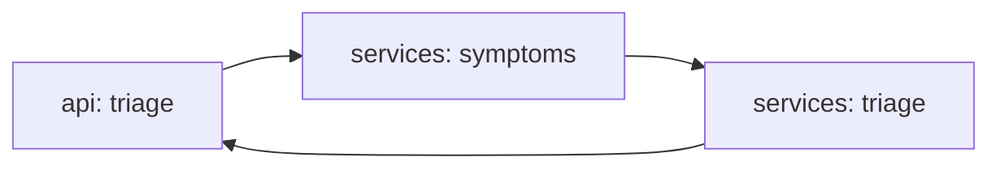

# agent-offline-medical

[](https://github.com/Shamanchi/agent-offline-medical/actions/workflows/ci.yml)
[](https://www.python.org/)
[](./Dockerfile)
[](./LICENSE)

> **English TL;DR:** FastAPI offline triage-info agent: symptom keywords → urgency level (emergency/urgent/routine/self-care) with self-care info and a mandatory see-a-doctor disclaimer. Informational only — never a diagnosis. Fully offline.

Агент доврачебной информации: симптомы → уровень срочности (emergency/urgent/routine/self-care) с советами самопомощи и обязательным дисклеймером «обратитесь к врачу». Только информация, не диагноз. Работает офлайн.

Источник темы: `Hands-On-AI-Engineering / P-136 (offline_medical_agent)` — идею и постановку взяли из каталога, код и тексты написаны с нуля.

## Какую задачу решает

В месте без связи нужно быстро сориентироваться: агент сопоставляет описанные симптомы с таблицей red-flag и обычных состояний, выдаёт уровень срочности, что делать сейчас и когда точно к врачу.

## Архитектура



Слои: `api/` → `services/` → `core/`, настройки через `pydantic-settings`.

## Быстрый старт

```bash
cp .env.example .env
pip install -r requirements.txt
uvicorn app.main:app --reload
curl -X POST http://127.0.0.1:8000/api/v1/triage -H "Content-Type: application/json" -d "{\"symptoms\": \"fever and dry cough for two days\"}"
```

Docker:

```bash
docker compose up --build
```

## API

- `GET /api/v1/health` — проверка сервиса.
- `GET /api/v1/symptoms` — известные симптомы.
- `POST /api/v1/triage` — оценка. Тело: `{"symptoms": "...", "age": 30}`. Ответ: `urgency`, `matched`, `advice`, `see_doctor`, `disclaimer`.

Пример ответа `triage` (сокращённо):

```json
{
  "urgency": "routine",
  "matched": ["fever", "cough"],
  "advice": ["Rest and fluids", "Monitor temperature"],
  "see_doctor": true,
  "disclaimer": "Informational only, not a diagnosis..."
}
```

## Переменные окружения (.env)

| Переменная | Назначение | По умолчанию |
|---|---|---|
| `APP_HOST` / `APP_PORT` | Хост/порт API | `0.0.0.0` / `8000` |

Полный список — в [.env.example](./.env.example).

## Тесты

```bash
pip install -r requirements.txt
pytest -q
pytest -q -m integration
```

Unit-тесты без сети. Интеграционные (`-m integration`) — через TestClient, тоже без сети.

## Контакты

- Telegram: @PavelYrevichh
- Email: Lietman46@mail.ru
- GitHub: Shamanchi
- FL.ru: https://www.fl.ru/users/Shamanchi
